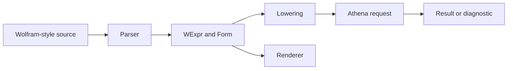
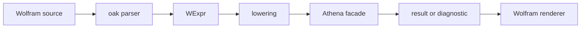

# @sxo/mathematica

[](https://github.com/ai4waifu/sxo-framework/actions) [](https://github.com/ai4waifu/sxo-framework/blob/dev/License.md)

`@sxo/mathematica` is the SXO Wolfram Language frontend. It is for users who need Wolfram Language source parsing,
symbolic forms, rendering, feature reports, the `wolframscript` command, or Jupyter installation helpers. It is not a
complete Mathematica implementation and it is not a Wolfram kernel.

## 🚀 Install

```bash
pnpm add @sxo/mathematica
```

Use the package from Node.js 20 or newer. Native optional dependencies are selected by npm when the runtime needs them.
Read the feature matrix before promising a language construct in an application.

## 🧠 What It Owns

This package owns Wolfram-facing syntax and forms, including the documented behavior of names, held expressions,
patterns, parts, rendering, and lowering. The Athena runtime owns mathematical execution. Parsing, lowering, rendering,
and evaluation are separate statuses: accepting source does not prove that every backend operation is available.

```ts
import { parse } from '@sxo/mathematica';

const form = parse('Hold[x^2 + 1]');
console.log(form.toString());
```

The exact API follows the installed declarations. Preserve structured forms and diagnostics instead of scraping display
strings.

## 💻 CLI and Jupyter

The package provides a `wolframscript` entry point and a Jupyter helper export. A kernelspec is an adapter around SXO
and does not provide full Mathematica compatibility. Record the Node.js executable, package version, and installation
location in notebook deployment logs.

## 🧭 Compatibility Boundaries

Use feature reports to distinguish supported, partial, parse-only, render-only, unsupported, and not-applicable
behavior. Do not infer semantics from familiar names. Unsupported constructs should remain visible to users and should
not be silently lowered to a different operation.

## 🩺 Diagnostics and testing

Use diagnostic codes and fields in automation. Test parsing, lowering, rendering, evaluation boundaries, feature
reports, and negative cases. SXO is `0.0.x`; pin versions and review changes.

## ⚡ From Source to a Useful Result

Start with a supported expression, inspect its parsed form, render it, and only then request evaluation. This shows
whether a failure belongs to syntax, lowering, runtime capability, or presentation.



For migration tools, preserve source spans and status. For notebooks, keep cell source, result, and diagnostic separate.
For services, set resource and cancellation limits before evaluation.

## 🧰 Common Use Cases

| Need                       | Recommended path | Important boundary           |
|----------------------------|------------------|------------------------------|
| Inspect Wolfram source     | parse and render | Rendering is not evaluation  |
| Build a migration report   | feature matrix   | Partial is not supported     |
| Run shell automation       | `wolframscript`  | It is an SXO host            |
| Install a notebook adapter | `./jupyter`      | Kernelspec adds no semantics |
| Embed in Node.js           | root export      | Manage sessions explicitly   |

## 🧩 WExpr, Forms, and Lowering

`WExpr` belongs to this frontend. It preserves language-facing structure and lowering choices. It is not a universal
expression type for other dialects. Held forms, patterns, parts, symbols, and evaluation-sensitive constructs require
semantic support, not only parser acceptance.

## 📊 Reading the Feature Matrix

Parse-only can support indexing and migration analysis. Render-only can support display. Partial needs a visible
limitation. Unsupported means stop or choose another path. Avoid a single compatibility percentage because applications
depend on different features.

## 📓 Notebook Guidance

Install the kernelspec in the environment that owns Node.js and the package. Record the executable path. After a kernel
restart, discard old handles. Render diagnostics with source locations and do not infer success from pretty output.

## 🖥️ Command-Line Guidance

Read `wolframscript --help` from the installed release. Capture exit status, diagnostics, locale, package version, and
runtime. Avoid matching English sentences in scripts.

## 🧯 Troubleshooting

If parsing fails, confirm the source dialect. If lowering fails, inspect the form and feature status. If native loading
fails, check Node.js, OS, CPU, ABI, and optional dependencies. If a notebook fails, inspect the kernelspec environment.

## 🔒 Security and Resource Control

Treat cells and uploaded expressions as untrusted input. Apply authentication, request-size, time, memory, and
cancellation policies. This frontend is not a security sandbox.

## 🗺️ Where to Go Next

Use Core for shared integrations, Simple Math for a small grammar, MATLAB for MATLAB source, and Lite for supported
browser workflows.

## 🧭 Start from a Wolfram workflow

Choose this package when your users think in Wolfram Language notation, when source files contain Mathematica-style
names and expressions, or when a notebook workflow needs an SXO-backed host. The package is designed to make the
frontend boundary visible: text is parsed into a Wolfram-oriented `WExpr`, lowered into the shared Athena
representation, evaluated by the common engine, and rendered back for a user or tool. This lets applications preserve
familiar source structure while keeping mathematical semantics in the shared engine.



The package is useful for migration experiments, source inspection, educational tools, test fixtures, and integrations
that need a Wolfram-shaped frontend. It is not a license manager, a proprietary Wolfram runtime, or a claim of complete
Mathematica compatibility.

## 🧩 Understand the expression model

`WExpr` represents frontend structure and preserves information needed by parsing, lowering, and rendering. Constructs
such as names, held expressions, patterns, and parts have syntax and presentation implications that do not belong in a
generic Simple Math frontend. The package keeps those concerns here so MATLAB and Simple Math code do not need to pass
through Wolfram objects.

| Concern                       | Owned by this package | Owned by shared Athena |
|-------------------------------|-----------------------|------------------------|
| Wolfram spelling and parsing  | Yes                   | No                     |
| `WExpr` and frontend forms    | Yes                   | No                     |
| Lowering to common IR         | Adapter boundary      | No dialect syntax      |
| Mathematical evaluation       | No                    | Yes                    |
| Wolfram-oriented rendering    | Yes                   | No                     |
| Node/Jupyter host integration | Host-facing exports   | No                     |

That division is important when interpreting a result. A parser success means the source has a supported frontend shape.
It does not mean every proprietary language behavior is available, and it does not change the engine’s exactness or
resource policies.

## 🖥️ CLI and scripting

The package exposes the `wolframscript` executable for command-line workflows. Use it for repeatable files, shell
pipelines, CI checks, and notebook-adjacent automation. Discover the current command surface with:

```bash
wolframscript --help
```

Scripts should pin package versions, preserve exit status, and keep diagnostic output separate from machine-readable
results. Do not parse localized message text as a protocol. Store the selected dialect and source fixture with generated
output when reproducibility matters.

## 📓 Jupyter workflows

The `./jupyter` export supports installation of the SXO Wolfram-oriented kernelspec through the native Node host.
Jupyter integration is intentionally host-specific. It is not part of `@sxo/lite`, does not run in a browser WASM
worker, and does not add ZMQ or notebook dependencies to Athena. Before installing a kernelspec, verify Node.js, the
package version, the executable path, and the environment in which Jupyter will launch the kernel.

After installation, test a fresh kernel with a trivial expression before opening a large notebook. Keep kernel startup
errors distinct from parse errors and evaluation diagnostics. In managed environments, inspect the generated kernelspec
and ensure the runtime path is available to the service account, not only to the interactive developer account.

## 📊 Feature discovery

Capability status lives under `tests/feature-matrix/` (R&D / acceptance only — not a product export). Use the report
script to print which frontend constructs are supported for the installed release. Treat `supported`, `partial`,
`unsupported`, and `unavailable` as different states. A feature marked unavailable because a native host is missing is
not the same as a feature that the dialect parser intentionally rejects.

```bash
pnpm --filter @sxo/mathematica report:features
```

Use feature reports in migration planning and CI, but do not turn a local comparison against proprietary software into a
compatibility promise. A small, explicit fixture suite is more useful than a broad undocumented claim.

## 🛠️ Troubleshooting

For a parse failure, reduce the source to the smallest expression and identify the construct that triggered the
diagnostic. Check names, held forms, patterns, parts, delimiters, and precedence. For a lowering failure, preserve the
source span and diagnostic code because the frontend may have parsed a form that the shared engine does not yet accept.
For a rendering difference, compare the structured result before comparing text.

For native loading problems, check `node --version`, `process.platform`, `process.arch`, optional dependency
installation, and the package manager lockfile. Install dependencies on the target operating system rather than copying
`node_modules` from another machine. For Jupyter issues, verify kernelspec paths and the account that launches the
kernel.

## 🔐 Resource and security boundaries

Treat notebook cells, uploaded files, and remote expressions as untrusted input. Apply authentication, request-size,
time, memory, and cancellation policies in the surrounding service. This frontend is not a security sandbox. Do not
grant filesystem or network access merely because an expression parsed successfully. Keep application permissions
separate from symbolic evaluation.

## 🚧 Compatibility and non-goals

The package does not promise identical behavior to Mathematica or Wolfram Engine, and it does not ship proprietary
implementations. It may intentionally reject syntax, preserve a form without evaluating it, or report a capability
boundary. The `0.0.x` series does not provide a compatibility guarantee for experimental APIs. Read the release notes
and feature matrix before upgrading a production integration.

## 🤝 Support and contribution

Include the package version, Node.js version, operating system, architecture, command or API call, minimal source
expression, expected result, actual result, and diagnostic code in an issue. Remove confidential notebook content.
Frontend syntax and rendering changes belong here. Shared mathematical behavior belongs in Athena, and browser host
behavior belongs in Lite. Contributions should include accepted and rejected examples and preserve the distinction
between parsed, lowered, evaluated, and rendered states.

## 📄 License

SXO is distributed under the Apache License 2.0. The license for this package does not grant rights to proprietary
external Wolfram products. Use the package as an explicit Wolfram-oriented frontend and host integration, with the
published feature boundaries as the source of truth.

