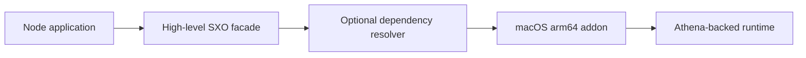

# Native Platform Artifact: macOS arm64

This package contains the macOS arm64 native SXO addon selected by supported high-level packages. Do not install or
import it as a general API. Install the package that represents your workflow and let npm resolve the optional platform
dependency.

Loading requires a matching macOS arm64 host and Node.js ABI. Check architecture, optional dependency installation, and
clean deployment behavior when troubleshooting.

## 🍎 Purpose

`@sxo/sxo-darwin-arm64` is the Apple Silicon native distribution artifact for the SXO Node.js host. It contains a
prebuilt Node-API addon selected transitively by public SXO packages. It is not a TypeScript library, command-line
interface, browser module, or standalone symbolic evaluator. Application developers should install `@sxo/sxo`,
`@sxo/core`, `@sxo/mathematica`, `@sxo/matlab`, or another high-level facade and allow the package manager to choose the
correct artifact.



The artifact keeps host loading separate from dialect syntax and shared mathematical semantics. It does not create a
second engine and must not become a direct application API.

## 📋 Platform contract

| Property         | Requirement                      |
|------------------|----------------------------------|
| Operating system | macOS (`darwin`)                 |
| Architecture     | ARM64 / Apple Silicon (`arm64`)  |
| Format           | Node-API `.node` addon           |
| Consumer         | Supported high-level SXO package |
| Direct import    | Not supported                    |
| Browser use      | Use `@sxo/lite`                  |

This package is intended for a native ARM64 Node process on Apple Silicon. An Intel Mac, or an x64 Node process running
under Rosetta, should resolve the x64 artifact instead. The physical computer model alone is not enough to determine the
selected package; Node’s process architecture controls native loading.

## 📦 Install the facade

```bash
pnpm add @sxo/mathematica
```

or:

```bash
npm install @sxo/sxo
```

The facade declares platform artifacts as optional dependencies. Direct installation of this package couples an
application to an implementation filename and can prevent future releases from selecting a compatible artifact. Import
the public facade and keep platform resolution an installation concern.

## 🔍 Verify Apple Silicon execution

Use Node to inspect the process that will load the addon:

```bash
node -p "process.version + ' ' + process.platform + ' ' + process.arch"
uname -m
```

Expected native output includes `darwin arm64` and `arm64`. If Node reports `x64`, it is running under translation and
the x64 package is the appropriate artifact for that process. Do not force an ARM64 binary into an x64 process or mix an
ARM64 dependency tree with an x64 Node installation.

## 🖥️ Deployment and packaging

Install dependencies on the same architecture used by the production process. For CI, make architecture explicit in
runner selection and cache keys. Include operating system, CPU, Node.js major version, lockfile hash, and facade version
in dependency cache keys. For desktop applications, preserve the `.node` file inside packaged resources and test the
installed application rather than only the development tree.

Native dependencies should be built and installed inside the deployment environment where practical. Copying
`node_modules` from an Intel Mac, Windows host, or Linux runner is not a portable deployment strategy. When using
universal or translated application packaging, document which Node process architecture is actually launched.

## 🛠️ Troubleshooting

If optional dependencies are absent, inspect package-manager flags, production-install settings, and platform entries in
the lockfile. Print `process.arch` before changing packages. If the loader fails, record the exact high-level package,
artifact version, Node version, macOS version, process architecture, and complete error. A missing optional dependency,
an architecture mismatch, a signing restriction, and a Node ABI problem are different failures.

Do not rename the native file, download an artifact from another release, or disable security controls as a workaround.
In an offline or enterprise environment, populate an approved package mirror with the complete dependency set and verify
artifact provenance. macOS quarantine, signing, and notarization policies may affect packaged applications even when the
dependency was installed correctly.

## 🧭 Relationship to other packages

Use `@sxo/sxo` for CLI workflows, `@sxo/mathematica` for Wolfram-oriented frontend and native Jupyter workflows,
`@sxo/matlab` for MATLAB-oriented frontend behavior, `@sxo/simple-math` for the smallest grammar, and `@sxo/lite` for
browser-first WASM execution. These packages own public initialization, diagnostics, feature scope, and user-facing
documentation. This artifact owns only the Apple Silicon native distribution unit.

It does not provide a parser, renderer, Jupyter protocol, browser loader, or stable TypeScript declarations. It cannot
be used to infer the complete feature set of the high-level packages.

## 🔐 Security and supply chain

Treat native binaries as executable dependencies. Pin versions, review lockfile changes, use the project’s trusted
publishing workflow, and verify package contents in internal mirrors. Do not accept an unverified binary to repair a
loader failure. Applications must still enforce input-size, time, memory, authentication, and cancellation policies
because native loading is not a sandbox.

## 🧪 Maintainer verification

Release checks should include clean optional resolution on a native Apple Silicon runner, behavior on Intel and
translated x64 hosts, loading through the relevant facades, packaged desktop paths, and a minimal symbolic request. Test
with the Node.js versions declared by the facade and keep the artifact revision aligned with the facade release.

## 🚧 Compatibility boundaries

This package does not promise a direct API, complete Mathematica or MATLAB compatibility, support for every macOS
packaging arrangement, or support for x64 processes. The `0.0.x` series permits artifact layout changes. Applications
should depend on public facades and follow their release notes.

## 🤝 Support and license

Include facade and artifact versions, Node.js and macOS versions, process and physical architecture, package manager,
lockfile state, optional-dependency settings, signing status, and loader diagnostics in issue reports. Remove
confidential source. SXO is distributed under the Apache License 2.0. See the
repository [LICENSE](https://github.com/ai4waifu/sxo-framework/blob/dev/License.md).

Keep deployment logs and architecture information with the application release record so future failures can be
distinguished from packaging, translation, or system-library issues.

This record should include the actual launched Node architecture and package-manager configuration.

Keep it with release artifacts for reliable incident response.

Always.


