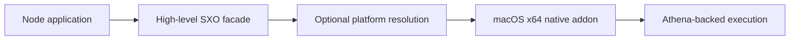

# Native Platform Artifact: macOS x64

This package contains the macOS x64 native SXO addon selected by the supported high-level packages. Application
developers should install `@sxo/core`, `@sxo/sxo`, or a dialect package rather than importing this implementation
artifact.

The binary must match the operating system, CPU architecture, Node.js ABI, and package version. Test clean deployment
hosts and preserve diagnostics when loading fails.

## 🍎 What this package is

`@sxo/sxo-darwin-x64` is a native distribution artifact for Node.js applications running macOS on Intel 64-bit hardware.
It is consumed by higher-level SXO packages as an optional dependency. It is not the public symbolic API, does not
contain TypeScript declarations, and should not be imported directly by application code. Install `@sxo/sxo`,
`@sxo/core`, `@sxo/mathematica`, `@sxo/matlab`, or another facade and let the package manager select the artifact.



The platform module keeps native loading separate from dialect parsing, rendering, and mathematical semantics. It does
not introduce a second engine or promise compatibility with an external computer-algebra product.

## 📋 Platform contract

| Property         | Requirement                        |
|------------------|------------------------------------|
| Operating system | macOS (`darwin`)                   |
| Architecture     | Intel 64-bit (`x64`)               |
| Native format    | Node-API `.node` addon             |
| Consumer         | A supported high-level SXO package |
| Direct API       | None                               |
| Browser support  | None                               |
| WASM support     | Use `@sxo/lite` instead            |

This artifact is not a native ARM64 build. On Apple Silicon, a native ARM64 Node process should select
`@sxo/sxo-darwin-arm64`. An x64 Node process running under Rosetta may select this artifact, but that is determined by
the process architecture, not merely by the physical Mac model.

## 📦 Installation

Use a public package:

```bash
pnpm add @sxo/mathematica
```

or:

```bash
npm install @sxo/sxo
```

The facade declares native artifacts as optional dependencies. A package manager resolves the matching operating system
and CPU package during installation. Directly adding this artifact makes an application depend on an implementation
filename and prevents the package family from selecting a future compatible build.

## 🔍 Confirming architecture

Before troubleshooting, inspect the host process:

```bash
node -p "process.version + ' ' + process.platform + ' ' + process.arch"
uname -m
```

For this package, Node should report `darwin x64`. On Apple Silicon, `uname -m` may report `arm64` while an x64 Node
process reports `x64` under translation. Record both values in deployment diagnostics. Mixing an ARM64 process, an x64
addon, and an incompatible loader can fail before JavaScript receives a useful error.

## 🖥️ macOS deployment

Install dependencies on the same architecture and Node.js major version used by the target process. Do not copy
`node_modules` from Windows or Linux, and do not copy an x64 dependency tree into a native ARM64 process. For desktop
applications, preserve the `.node` file inside packaged resources and verify that the runtime loader can resolve its
installed path after packaging.

For CI caches, include macOS, CPU architecture, Node.js major version, lockfile hash, and high-level SXO version in the
key. Test a clean install instead of relying only on a warm cache. If a deployment uses Rosetta intentionally, document
that choice and test the same process architecture in CI.

## 🛠️ Troubleshooting

When optional dependency installation is skipped, inspect package-manager flags and lockfile platform entries.
Production installs that omit optional dependencies can remove the native artifact even though the high-level package is
installed correctly. When loading fails, capture the exact diagnostic, Node version, `process.arch`, macOS version,
package version, and whether the process is native ARM64 or translated x64.

Do not rename the `.node` file, download a binary from an unrelated release, or disable security checks to force
loading. Node-API compatibility, architecture, signing policy, and release alignment all matter. In a restricted
network, use an approved package mirror containing the complete platform-specific dependency set and verify its
provenance.

macOS security controls may quarantine or block native modules in packaged applications. Follow the organization’s
code-signing and notarization process. A quarantine or signing issue is different from a missing optional dependency and
should be diagnosed through the application packaging pipeline.

## 🧭 Relationship to other packages

Use `@sxo/sxo` for the CLI, `@sxo/mathematica` for Wolfram-oriented frontend behavior and native Jupyter integration,
`@sxo/matlab` for MATLAB-oriented frontend behavior, `@sxo/simple-math` for the smallest syntax surface, and `@sxo/lite`
for browser-first WASM execution. These packages own public initialization, diagnostics, and feature documentation. This
artifact owns only the macOS Intel distribution unit.

It does not provide a parser, renderer, Jupyter protocol, browser loader, or stable TypeScript surface. It should not be
used to infer the full feature scope of any high-level package.

## 🔐 Security and supply chain

Treat native artifacts as executable dependencies. Pin versions, review lockfile changes, use the project’s trusted
publishing workflow, and verify package contents in internal mirrors. Do not accept an unverified binary as a repair for
an installation failure. Applications still need input-size, time, memory, and cancellation policies for untrusted
expressions because native loading is not a security sandbox.

## 🧪 Maintainer verification

Release verification should cover clean optional resolution on an Intel macOS runner, failure behavior on ARM64 and
unsupported hosts, loading through relevant high-level facades, packaged desktop paths, and a minimal symbolic request.
Keep artifact and facade versions aligned and test both native and translated x64 processes if the project supports
them.

## 🚧 Compatibility boundaries

This package does not promise a direct API, complete Mathematica or MATLAB compatibility, support for every macOS
packaging arrangement, or support for ARM64 native processes. The `0.0.x` series permits artifact layout changes.
Applications should depend on public facades and their release notes.

## 🤝 Support and license

Include the facade version, artifact version, Node.js version, macOS version, process architecture, physical
architecture, package manager, lockfile state, optional-dependency settings, signing status, and complete loader
diagnostic in issue reports. Remove confidential source. SXO is distributed under the Apache License 2.0. See the
repository [LICENSE](https://github.com/ai4waifu/sxo-framework/blob/dev/License.md).

Preserve deployment logs with the application release record for future diagnosis.


