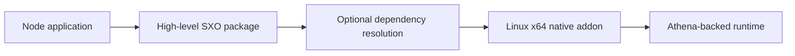

# Native Platform Artifact: Linux x64

This package is an optional Linux x64 native addon for the SXO high-level packages. Install the high-level package
instead of importing this artifact directly. npm selects it when the operating system and CPU match the published
binary.

Deployment images must provide the runtime libraries required by the produced binary. Test the exact container and
Node.js ABI used in production. If loading fails, inspect the diagnostic, package manager optional-dependency settings,
libc environment, and architecture before filing an issue.

## 🧭 What this package is

`@sxo/sxo-linux-x64` is a distribution artifact for the Linux x64 Node.js host path. It contains
`sxo.linux-x64-gnu.node`, a prebuilt Node-API addon consumed by higher-level SXO packages. It is not a command-line
tool, a TypeScript API, a browser module, or a standalone symbolic evaluator. Application developers should install
`@sxo/sxo`, `@sxo/core`, `@sxo/mathematica`, `@sxo/matlab`, or another public facade and let the package manager select
the correct optional artifact.



This separation keeps platform loading independent from dialect syntax and mathematical semantics. The artifact does not
introduce a second engine and should not be imported to bypass the facade.

## 📋 Platform contract

| Property         | Requirement                                 |
|------------------|---------------------------------------------|
| Operating system | Linux (`linux`)                             |
| Architecture     | 64-bit x86 (`x64`)                          |
| Artifact         | `sxo.linux-x64-gnu.node`                    |
| ABI              | Compatible Node-API host                    |
| C library        | GNU/glibc environment expected by the build |
| Consumer         | High-level SXO package                      |

This package is not intended for Linux ARM64, 32-bit Linux, musl-only Alpine images, browsers, or arbitrary WASM hosts.
A musl deployment may require a separate artifact or a supported native-free route such as `@sxo/lite`. Do not infer
compatibility from the fact that both systems are called Linux.

## 📦 Installation

Install a public package:

```bash
npm install @sxo/sxo
```

or:

```bash
pnpm add @sxo/mathematica
```

The high-level package declares native artifacts as optional dependencies. A supported Linux x64 installation should
resolve this package automatically. Directly adding the platform artifact creates a fragile dependency on an
implementation filename and makes it harder for the package manager to select a future compatible release.

## 🐧 Containers and deployment

Build and install dependencies inside the same image family used to run Node.js. Do not copy `node_modules` from a macOS
or Windows workstation. The native module must remain in the packaged application resources, and the runtime loader must
be able to resolve it from the installed package path.

For CI caches, include operating system, architecture, Node.js major version, libc family, lockfile hash, and high-level
SXO version in the cache key. Test a clean install at least once per release. Minimal container images should be checked
for the dynamic libraries required by the produced addon. An image that can install the package but lacks runtime
libraries can still fail when Node loads the module.

## 🔍 Diagnosing a load failure

Print the host identity before changing dependencies:

```bash
node -p "process.version + ' ' + process.platform + ' ' + process.arch"
ldd --version
```

Expected host output includes `linux x64`. Inspect whether optional dependencies were omitted by a production install
flag, whether the lockfile was generated for another platform, and whether the container uses glibc or musl. Check the
exact error emitted by the high-level package rather than guessing from a missing file.

Do not rename a platform artifact, copy a binary from another release, or download an unrelated `.node` file. ABI and
dependency mismatches can fail before JavaScript receives a useful diagnostic. In an offline environment, populate an
approved package mirror with the complete platform-specific dependency set and verify its provenance.

## 🧱 Relationship to SXO packages

Use `@sxo/sxo` for CLI workflows, `@sxo/mathematica` for Wolfram-oriented frontend behavior, `@sxo/matlab` for
MATLAB-oriented frontend behavior, `@sxo/simple-math` for the smallest grammar, and `@sxo/lite` for browser-first WASM
execution. Those packages own public APIs, initialization, diagnostics, and feature documentation. This package owns
only the Linux x64 native distribution unit.

Jupyter support, where available, belongs to the native Mathematica host package. It is not implemented in this platform
artifact and is not available through browser WASM. Dialect parsing and rendering also remain outside this package.

## 🛡️ Security and supply chain

Native binaries deserve the same provenance controls as any executable dependency. Pin versions, review lockfile
changes, use the project’s trusted publishing workflow, and verify package contents in enterprise mirrors. Do not
disable security scanning merely because the module is an optional dependency. Treat downloaded expressions as untrusted
input and apply application-level authentication, time, memory, and cancellation limits.

## 🧪 Maintainer verification

Maintainers should test successful optional resolution on a supported glibc Linux x64 runner, failure behavior on an
unsupported architecture, a clean production install, loading through each relevant high-level facade, and a minimal
symbolic request. Verify that the package is not accidentally required by browser bundles. Keep generated native
artifacts aligned with the release revision and test the Node.js versions declared by the facade.

## 🚧 Compatibility boundaries

This artifact does not promise complete Mathematica or MATLAB compatibility, a stable direct API, support for every
Linux distribution, or support for every libc implementation. The `0.0.x` package family may change artifact names and
loading details. Applications should depend on the public facade and follow its release notes instead of depending on
this package’s internal filename.

## 🤝 Support and license

Include the high-level package version, platform artifact version, Node.js version, kernel/container image,
architecture, libc output, package manager, lockfile state, optional-dependency settings, and complete loader diagnostic
in issue reports. Remove confidential source expressions. SXO is distributed under the Apache License 2.0. See the
repository [LICENSE](https://github.com/ai4waifu/sxo-framework/blob/dev/License.md).

When publishing an application image, record the base image digest and installation command with the release artifact.
That information makes native loader failures reproducible and helps distinguish an SXO packaging regression from a
missing system library or an omitted optional dependency.

Keep this record with deployment documentation.

Always preserve it.


