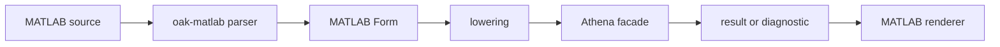

# @sxo/matlab

[](https://github.com/ai4waifu/sxo-framework/actions) [](https://github.com/ai4waifu/sxo-framework/blob/dev/License.md)

`@sxo/matlab` is the MATLAB frontend for SXO. It helps MATLAB users and tooling authors parse source, inspect forms,
lower expressions to the SXO execution contract, render results, and review feature coverage during migration. It is not
a MATLAB runtime, toolbox implementation, or MATLAB-compatible kernel.

## 🚀 Install

```bash
pnpm add @sxo/matlab
```

The package is an ESM TypeScript API for Node.js workflows. Use the feature matrix export and report command before
exposing a construct in a product.

## 🧭 Workflow

```text
MATLAB source -> parser -> Form -> lowering -> SXO execution request
```

Parsing, lowering, rendering, and execution are separate steps. A construct can be recognized for migration analysis
while remaining unsupported for execution. Keep source locations and diagnostics when presenting that distinction.

## 🎯 Scope

The package owns MATLAB syntax and frontend behavior. SXO provides mathematical execution. Do not assume that MATLAB
functions, indexing, assignment, scripts, toolboxes, or runtime side effects are available merely because a name parses.
Unsupported behavior should be reported explicitly.

This package does not support GNU Octave. Octave has its own extensions, package conventions, and runtime semantics, so
an Octave file that resembles MATLAB may still require behavior outside this frontend's contract. Treat Octave source as
unsupported unless a specific construct is explicitly listed in the feature report. A successful parse of one shared
MATLAB/Octave expression must not be presented as general Octave compatibility.

## 📊 Feature Reports

Use the feature matrix to distinguish supported, partial, parse-only, render-only, unsupported, and not-applicable
features. Store the report with migration artifacts so users can see which changes are required. Do not turn a feature
percentage into a compatibility claim.

## 🩺 Diagnostics and testing

Use structured diagnostic codes in automation and localized text only for display. Add resource limits around services
evaluating user input. SXO is `0.0.x`; pin versions.

## 🧭 Begin with a MATLAB source file

This package is for users and tools that need to process MATLAB source through an SXO frontend. It can parse source,
expose a MATLAB Form, lower supported constructs into the shared Athena representation, and render results or
diagnostics. That makes it useful for migration analysis, code editors, documentation tooling, expression experiments,
and test fixtures. It is not a MATLAB interpreter, a MATLAB installation, or a replacement for a licensed numerical
environment.



The stages are intentionally visible. A source file can be accepted by the parser but rejected during lowering when the
shared engine does not yet support the construct. A value can be evaluated successfully and still have a renderer
limitation. Applications should preserve these states instead of collapsing every failure into “invalid MATLAB”.

## 📋 What belongs where

| Concern                               | This package     | Athena/shared runtime |
|---------------------------------------|------------------|-----------------------|
| MATLAB spelling and grammar           | Yes              | No                    |
| MATLAB Form and source spans          | Yes              | No                    |
| Form-to-IR lowering                   | Adapter boundary | No MATLAB syntax      |
| Mathematical semantics                | No               | Yes                   |
| Evaluation and rewriting              | No               | Yes                   |
| MATLAB rendering                      | Yes              | No                    |
| Node host and optional native loading | Host package     | No                    |

This boundary prevents a MATLAB-specific implementation from becoming a second numeric or symbolic engine. Shared
mathematical behavior should be fixed once in Athena and then exercised through the frontend contract.

## 🧰 Migration workflow

For migration work, start with a representative corpus rather than a single successful example. Classify files by syntax
family, record the feature-matrix state for each construct, and keep the original source span with every finding. A
practical loop is:

```text
source file -> parse -> feature classification -> lower supported forms
            -> evaluate selected expressions -> render -> review diagnostics
```

Separate parse-only success from executable success. A tool that highlights MATLAB syntax may need only the first two
stages. A symbolic notebook or conversion utility may need lowering, evaluation, and rendering. This distinction helps
teams avoid promising execution when their actual product only performs source analysis.

## 📊 Feature matrix and reports

The package exports `./feature-matrix` and provides a report command after building:

```bash
node ./dist/feature-matrix/cli.js
```

Interpret each state carefully:

| State         | Meaning                                             |
|---------------|-----------------------------------------------------|
| `supported`   | The documented path is available                    |
| `partial`     | Only a declared subset is handled                   |
| `parse-only`  | Syntax is recognized but not executable             |
| `render-only` | Presentation exists without full evaluation         |
| `unsupported` | The construct is outside the current frontend scope |
| `unavailable` | The host or optional runtime is missing             |

Store reports alongside migration artifacts and pin the package version used to produce them. A feature percentage is
not a MATLAB compatibility score and should not be presented as one.

## 🧪 Testing MATLAB integrations

Build tests around user-visible stages. Include ordinary expressions, nested calls, indexing and delimiters where
supported, malformed source, unsupported constructs, lowering failures, and rendering differences. Keep a minimal
fixture for each diagnostic code. Assert structure before text: rendered output may evolve while the lowered meaning
remains stable.

When comparing with a MATLAB installation, document the exact input, expected interpretation, version, and licensed
features. Local comparisons are useful for migration decisions, but they do not establish a general compatibility claim.
External MATLAB execution is not part of this package’s installation or automated CI contract.

## 🖥️ Node usage and native behavior

The package is an ESM TypeScript runtime with declarations and optional platform addons. Install it in a Node.js
application that needs the frontend, then use the exported API described by the generated declarations. Native loading
is a host concern. Check Node.js version, operating system, architecture, lockfile state, and optional dependency
installation when a clean machine behaves differently from a developer workstation.

Browser applications should select `@sxo/lite` where its feature scope is sufficient. Do not copy a native `.node` file
into a browser bundle or treat platform artifacts as a direct MATLAB API.

## 🔐 Resource and security boundaries

Source files and expressions may be supplied by users or remote systems. Apply authentication, input-size, timeout,
memory, and cancellation policies in the surrounding application. Parsing is not authorization, and this frontend is not
a sandbox. Keep filesystem, network, and process permissions separate from symbolic evaluation.

## 🛠️ Troubleshooting

For a parser error, reduce the source to the smallest expression and inspect the reported span. For a lowering error,
retain the feature state and diagnostic code. For a rendering issue, compare the structured result first. For native
problems, check platform values with Node and reinstall from the lockfile. For a report mismatch, verify that the
command uses the same package build and configuration as the application.

## 🚧 Compatibility and release scope

This is a MATLAB frontend, not a MATLAB kernel and not a GNU Octave implementation. It does not promise identical
numerical algorithms, proprietary toolbox behavior, complete MATLAB language coverage, Octave compatibility, or
identical output formatting. SXO is in the `0.0.x` series, so experimental APIs may change. Pin versions, review release
notes, and rerun your feature corpus before upgrading.

## 🤝 Support and contribution

Issue reports should include package version, Node.js version, operating system, architecture, source excerpt, selected
API, expected stage, actual stage, and diagnostic code. Remove proprietary source. Contributions should add positive and
negative fixtures and state whether a change affects parsing, Form structure, lowering, rendering, or host integration.
Changes to shared mathematics belong in Athena, not this dialect package.

## 📄 License

SXO is distributed under the Apache License 2.0. This license does not grant rights to proprietary MATLAB products. Use
the package as an explicit frontend and migration component, guided by its feature matrix and documented boundaries.

