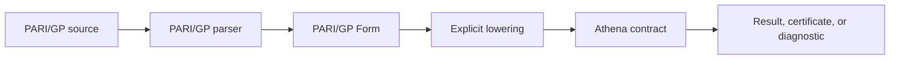

# @sxo/pari-gp

 

`@sxo/pari-gp` is the reserved SXO package for a future PARI/GP-oriented frontend. It is intentionally an empty
placeholder today. No PARI/GP parser, evaluator, renderer, native binding, WebAssembly module, or compatibility layer is
shipped in this package. Installing it does not provide a working PARI/GP environment.

The package exists so the workspace can reserve a clear product boundary before implementation begins. A reserved name
is useful for documentation, package selection, and future integration planning, but it must not be confused with a
feature claim. If you need symbolic computation now, choose an implemented SXO package whose documented input and
runtime match your application.

## 🛑 What You Get Today

The current package contains only metadata and this README. It has no executable entry point and intentionally exports
no JavaScript API. There is no `parse`, `evaluate`, `gp`, `install`, or native-loader function to call. A successful npm
installation means only that the placeholder package was downloaded or resolved from a workspace. It does not mean that
PARI/GP syntax is accepted or that number-theory operations are available.

| Capability              | Current status | Meaning                              |
|-------------------------|----------------|--------------------------------------|
| PARI/GP source parser   | Not shipped    | Source text is not interpreted       |
| Symbolic evaluator      | Not shipped    | No computation is performed          |
| PARI/GP renderer        | Not shipped    | No GP-compatible output is generated |
| Native PARI/GP binding  | Not shipped    | No system library is loaded          |
| Browser or WASM runtime | Not shipped    | No browser execution is provided     |
| Feature matrix          | Planning only  | No compatibility score is implied    |
| TypeScript API          | Not shipped    | There are no declarations or exports |

## 🧭 Why Reserve a Package

PARI/GP users have a distinct workflow. They may work with exact integers, rational arithmetic, modular arithmetic,
finite fields, polynomials, number fields, ideals, class groups, elliptic curves, L-functions, and command-oriented
scripts. Those concepts cannot be represented honestly by copying a few function names into a generic expression parser.
A future adapter needs to decide which syntax belongs to a PARI/GP Form, which operations lower to the Athena contract,
which results need evidence or conditions, and which capabilities require a native PARI backend.

Reserving the package creates a place for that design without putting PARI/GP assumptions into Simple Math, Mathematica,
MATLAB, or Core. The eventual adapter should remain a dialect frontend. It should not become a second mathematical
engine and should not hide an unverified foreign library behind a generic SXO value.

## 🧩 Intended Future Boundary

The intended flow is:

The future package may own source syntax, GP-style names, command forms, rendering, source spans, and feature reports.
Athena should own shared exact numeric semantics and the execution contracts that are actually supported. A native
PARI/GP library, if ever used, would need an explicit adapter and correctness boundary. It must not silently become the
canonical storage of SXO values.

## 👥 Who Should Use It

At present, no end-user workflow should depend on this package. Maintainers may use it to reserve naming, prototype
package metadata, or discuss the future adapter boundary. Application authors should select an implemented package
instead:

| Your current need               | Use                |
|---------------------------------|--------------------|
| Small symbolic expressions      | `@sxo/simple-math` |
| Wolfram-style frontend behavior | `@sxo/mathematica` |
| MATLAB-style source frontend    | `@sxo/matlab`      |
| Shared TypeScript integration   | `@sxo/core`        |
| Browser-first WASM route        | `@sxo/lite`        |
| Shell automation                | `@sxo/sxo`         |

Those alternatives do not claim PARI/GP compatibility. They are simply the implemented packages with their own
documented boundaries.

## 📦 Installation Behavior

The manifest is private in the workspace. It is not a publishable public API and should not be added to an application
dependency list as a way to obtain PARI/GP. If a future release becomes public, its publication metadata must change
together with a real API, tests, feature report, and runtime contract. Until then, package managers may resolve it only
in workspace or maintainer contexts.

Do not add a native PARI library to your application merely because this placeholder exists. System-level PARI/GP
installation, license, ABI, platform, and data-file behavior would require a separate documented integration. None of
those requirements are currently implemented here.

## 🧪 What a Real Implementation Must Prove

A future implementation should begin with a narrow, testable subset rather than a broad compatibility slogan. It should
document source grammar, Form identity, lowering rules, exact versus approximate results, domain and parent checks,
error diagnostics, and feature status. Number-theory operations should distinguish computed candidates from verified
facts. For example, a probable prime result must not be advertised as a proved prime without the appropriate evidence.

The package should also test round trips, malformed syntax, unsupported constructs, large integer boundaries, modular
semantics, cancellation, resource limits, and native/WASM availability. A feature matrix should be generated from
executable tests where practical. A parser test alone cannot establish that Athena can execute the lowered operation.

## 🧱 Runtime and Dependency Expectations

The future package may eventually support a native Node path, a WASM path, or both. Those paths must be explicit. Native
platform packages would be optional artifacts selected by the high-level facade. A browser package would need a separate
loading and memory contract. A Jupyter integration would be a host adapter, not proof of complete GP language support.

Until those decisions are implemented and documented, this placeholder has no runtime requirements beyond the package
manager. It should not advertise Node, WASM, Jupyter, or PARI/GP version compatibility.

## 🧯 Troubleshooting

If you installed this package expecting a parser or evaluator, that is the expected explanation: the package is empty by
design. Remove it from the application dependency list and choose an implemented SXO package. If a workspace tool
reports that the package has no build script, that is also expected. If another package claims to provide PARI/GP
behavior, verify that it is a separate implementation and read its feature report rather than inferring support from
this reserved name.

For a future implementation issue, include the package version, source category, intended PARI/GP operation, expected
status, actual diagnostic, runtime, and whether the issue is parser, lowering, execution, rendering, or packaging
related. Do not include proprietary source when a minimal public example is sufficient.

## 🚧 Non-Goals

This placeholder is not a PARI/GP distribution, not a wrapper around the system `gp` executable, not a number-theory
engine, not a compatibility promise, and not a request to place PARI/GP semantics into another SXO dialect. It does not
download native libraries, execute shell commands, or provide a fallback evaluator.

## 🔭 Project Direction

The useful next step is design work: identify the highest-value PARI/GP workflows, choose the first exact subset, define
the Form and lowering contracts, decide which results need certificates, and specify native and browser boundaries.
Implementation should follow those contracts. A package name alone is not a feature.

## 🤝 Support

Questions about the future adapter belong in the SXO repository issue tracker. Please describe the user workflow and
mathematical operation rather than requesting broad “PARI compatibility.” Narrow requests are easier to evaluate, test,
and document without overpromising.

## 📄 License

This placeholder is distributed under the Apache License 2.0. See
the [repository license](https://github.com/ai4waifu/sxo-framework/blob/dev/License.md). The license does not grant
rights to PARI/GP or any third-party software.
