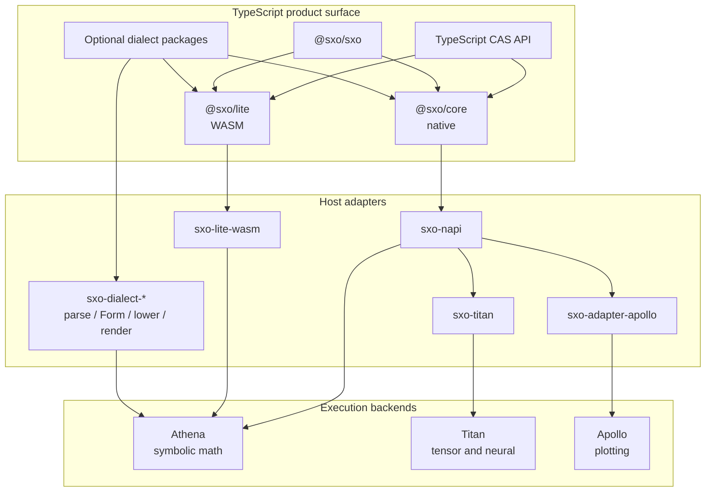
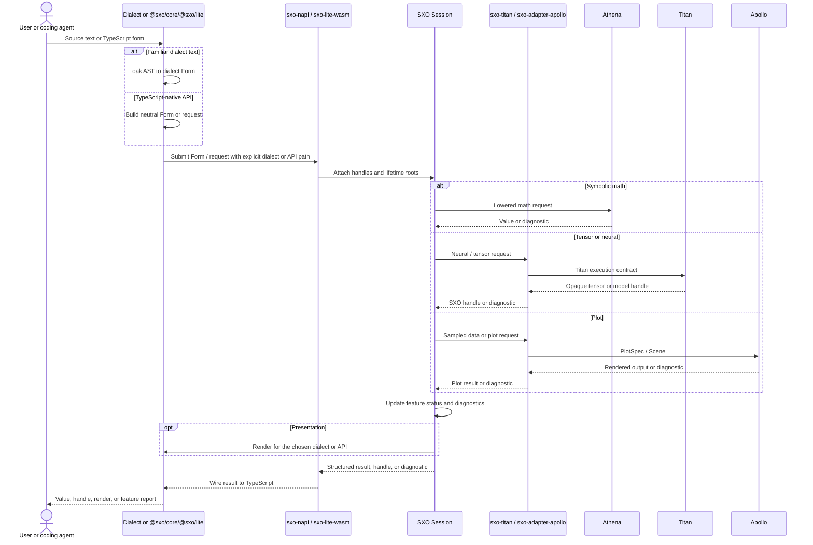

# SXO

Scientific computing for agents and TypeScript apps

[](https://github.com/ai4waifu/sxo-framework/actions) [](https://github.com/ai4waifu/sxo-framework/blob/dev/License.md) [](https://nodejs.org/)

SXO is a TypeScript-first symbolic-computation layer for scientific work.

AI agents can adopt it through `npx @sxo/skills`, and the same workflow can move into Node.js services, CLIs, notebooks,
and browsers with `@sxo/core` and `@sxo/lite`.

If you already know Mathematica or MATLAB, you can keep using those familiar languages through `@sxo/mathematica` or
`@sxo/matlab`. That is an option, not the only door. Dialect packages stay honest about coverage through feature
matrices and structured diagnostics: a familiar name may parse today and still be partial, unsupported, or not yet
executable.

## 🚀 Get started

### Start with an AI coding agent

Install the SXO skill first:

```bash
npx @sxo/skills
```

Then ask for the scientific outcome. After installation, package choice, honest coverage, Discussion reporting, and
secret redaction are handled by the skill automatically — you do not need to repeat them in the prompt.

```text
Help me implement this scientific workflow with SXO in Node.js.
```

```text
I already know MATLAB, so use @sxo/matlab where it helps.
Help me run this scientific project on SXO.
```

```text
I already know Mathematica, so use @sxo/mathematica where it helps.
Help me run this scientific project on SXO.
```

When you later embed the same scientific workflow in a TypeScript service or browser app, reach for `@sxo/core` or
`@sxo/lite`.

### Choose a package

| Goal                            | Package            | Audience                                 |
|---------------------------------|--------------------|------------------------------------------|
| TypeScript integration          | `@sxo/core`        | Library and application authors          |
| Browser or worker execution     | `@sxo/lite`        | Frontend and bundler users               |
| Familiar Wolfram-style source   | `@sxo/mathematica` | Optional if you already know Mathematica |
| Familiar MATLAB-style source    | `@sxo/matlab`      | Optional if you already know MATLAB      |
| Small predictable grammar       | `@sxo/simple-math` | Examples, education, tests               |
| Shell, CI, or scripted commands | `@sxo/sxo`         | Node.js automation users                 |

Platform packages are optional native artifacts selected by npm. The internal WASM artifact is consumed by `@sxo/lite`,
not installed directly. The homepage is a private site application.

### Traditional manual install

TypeScript-first:

```bash
pnpm add @sxo/core
```

If you already know Mathematica:

```bash
pnpm add @sxo/mathematica
```

```ts
import {parse} from '@sxo/mathematica';

const form = parse('Hold[x^2 + 1]');
console.log(form.toString());
```

If you already know MATLAB:

```bash
pnpm add @sxo/matlab
```

Browser or Worker deployments:

```bash
pnpm add @sxo/lite
```

Results are symbolic values, not JavaScript `number` values. Preserve their structure or cross to machine numbers
explicitly. For shell workflows:

```bash
npm install --global @sxo/sxo
sxo --help
```

Start from the scientific goal. Use a familiar dialect only when that language helps you move faster. Use `@sxo/core`
when you need structured results, stable diagnostics, or application-controlled lifetime management. Use `@sxo/lite`
when the deployment cannot load native addons.

## 🏗️ Architecture

### Layered stack



SXO is the product and host orchestration layer. It owns TypeScript APIs, optional dialects, Session lifetime, opaque
handles, diagnostics, feature reporting, and thin bridges into backends. It does not reimplement CAS, tensor runtimes,
or plot engines.

- **`@sxo/core` / `@sxo/lite`** — isomorphic TypeScript CAS surfaces for native and WASM
- **Optional dialects** — familiar language syntax only when you already know them
- **`sxo-napi` / `sxo-lite-wasm`** — host bindings, Session bridge, diagnostic wire
- **`sxo-titan` / `sxo-adapter-apollo`** — thin adapters into Titan and Apollo
- **Athena / Titan / Apollo** — opaque execution backends behind stable contracts

There is no `sxo-engine`. Dialects do not own evaluation. Backends do not define the TypeScript product object model.

### Computation process



A request can succeed, return partial status, or fail with structured diagnostics. Parsing acceptance is not the same as
execution support. Rendering is optional presentation, not identity. Mixed math / tensor / plot work must cross backends
through explicit bridges, not silent conversion.

## 💡 Concepts

### Dialects

Dialect packages are optional familiar-language surfaces. If you already know Mathematica or MATLAB, you can keep using
that syntax on SXO. If you do not, you can stay on TypeScript with `@sxo/core` / `@sxo/lite`.

`@sxo/mathematica` supports a defined Wolfram-style frontend surface, rendering, feature reporting, the `wolframscript`
command, and Jupyter helpers. It is not a bundled Wolfram kernel and not a silent promise of complete Mathematica
compatibility.

`@sxo/matlab` parses supported MATLAB-style source, lowers it to SXO/Athena forms, renders it, and reports unsupported
or partial features. It is not a MATLAB runtime or toolbox replacement.

`@sxo/simple-math` remains available for examples, teaching tools, tests, and lightweight applications with a
deliberately narrow grammar.

### Native, WASM, and Jupyter

Use native Node packages for the broadest supported Node behavior, CLI integration, and notebook helpers. Optional
dependencies select an OS and CPU artifact. Test clean containers because a development machine may have libraries that
production does not.

Use `@sxo/lite` for browser-first deployments, workers, and bundlers that cannot install native addons. WASM has
different startup, memory, transfer, and debugging characteristics. Initialize it asynchronously and keep long
operations away from the UI thread.

Use the Mathematica package's Jupyter helper for notebook protocol integration. A kernelspec is an adapter around SXO.
It does not make unsupported language features execute.

### Sessions and handles

Treat a session as the owner of runtime state. Expressions, numeric values, caches, and native or WASM resources may be
associated with it. Handles are opaque references into managed state. They are not serialized syntax trees, JavaScript
numbers, or stable memory addresses.

Keep handles alive while their session is alive. Do not use a handle after closing its session, move handles between
independent WASM instances, or retain native references without the package API. JavaScript garbage collection is not
the same as runtime resource reclamation.

### Diagnostics and feature reports

Prefer structured diagnostics over matching display text. Diagnostics can identify an operation, source location,
unsupported feature, domain mismatch, resource limit, cancellation, or runtime failure. Localized messages may change
with locale, while codes and structured fields are intended for automation.

Use feature-matrix commands or subpath exports before promising behavior. Supported, partial, parse-only, render-only,
unsupported, and not-applicable are different states and should remain different in application code.

## 🧭 Use and operate

### Deployment

Pin Node.js and package-manager versions for native deployments. Test every target OS and CPU on a clean host. For
browser builds, verify WASM asset handling, worker URLs, CSP headers, base paths, and offline behavior. Never import
`@sxo/lite-unknown-wasm32` directly.

Apply authentication, request-size, time, memory, and cancellation limits around services that evaluate user input.
Long-lived runtimes should not be exposed to untrusted users without an explicit resource policy.

### Practical workflow patterns

For a command-line report, keep source input in a file, select the dialect explicitly, capture standard output and
diagnostics separately, and record the package version in the report metadata. This makes a failed build reproducible
and prevents a display change from silently breaking a pipeline. For a service, create a session per tenant or per
isolation boundary, enforce a request budget, and return structured status to the caller. Do not let an HTTP request
hold an unbounded queue of expressions in one process.

For an editor integration, parse early, preserve the original source span, and show partial or unsupported status beside
the source rather than hiding it behind a generic error. Keep the rendered form separate from the editable source. A
renderer is allowed to choose stable notation for display while the parser continues to own source-language details.

For a notebook, initialize once per kernel session, keep output values associated with the cell execution that produced
them, and surface diagnostics with source locations. Restarting a kernel invalidates its handles. A notebook extension
should therefore detect session changes and clear stale references instead of retrying them indefinitely.

For a browser application, load WASM during an explicit initialization phase, show loading and failure states, and move
expensive work to a worker. If the application needs a feature that is only available through native Node bindings, say
so in the product design and provide a server or precomputation path. Do not make a browser bundle depend on an
accidental native fallback.

### Troubleshooting checklist

When installation fails, check Node.js version, package-manager version, operating system, CPU architecture, and whether
optional dependencies were omitted. When a native addon fails to load, test the high-level package on a clean host and
inspect the diagnostic before importing any platform artifact directly. When a browser build fails, inspect the emitted
WASM URL, worker path, CSP, and bundler asset configuration.

When parsing fails, confirm that the input belongs to the selected dialect and consult its feature matrix. When
evaluation returns a partial result, preserve the status and diagnostic code. When a handle becomes invalid, check
whether its session or worker was restarted. When output differs after an upgrade, compare package versions, dialect
selection, runtime mode, and feature-report status before comparing display strings. When the failure is deterministic
and contradicts documented behavior, open a Bug discussion rather than a GitHub Issue.

## 📜 Contracts

### What SXO guarantees

SXO guarantees package-level contracts for scientific workflows, not universal commercial-kernel equivalence. A package
documents the input forms it accepts, the result categories it returns, its runtime requirements, and the diagnostics it
can produce. Feature matrices make supported, partial, and unsupported states visible so work can proceed without hidden
gaps. Athena supplies the mathematical runtime behind the supported operations.

SXO also keeps agent adoption and TypeScript embedding first-class. `@sxo/skills` teaches coding agents the package map
and reporting rules. `@sxo/core` and `@sxo/lite` keep scientific workflows embeddable in services and browsers.
Mathematica and MATLAB dialects remain optional familiar-language choices with explicit boundaries. Native and WASM
packages identify their different operational constraints.

### What SXO does not guarantee

SXO does not yet guarantee that every expression accepted by a dialect is executable, that every renderer is reversible,
or that a familiar function name has identical semantics to Mathematica or MATLAB in every case. It does not guarantee
the performance profile of native and WASM on every workload. It does not provide a general sandbox for arbitrary
untrusted programs. It does not replace authentication, authorization, cancellation, request limits, or deployment
observability.

These limits are intentional during growth. Honest boundaries let scientific work proceed package by package and let
familiar dialects expand without turning partial support into a false compatibility promise.

## 🛠️ Develop

### Workspace development

```bash
pnpm install
pnpm build:native
pnpm build:ts
pnpm test:js
pnpm lint
```

Native and WASM builds require the toolchains documented by their scripts. Run focused package tests before the complete
build.

### Repository layout

The repository keeps product packages under `projects/packages`, native and WASM artifacts under `projects/platforms`,
Rust dialects and bindings under `projects/dialects` / `projects/bindings` / `projects/adapters`, private R&D tooling
under `projects/tooling` (including `@sxo/harness` and `@sxo/skills`), and the marketing site under `projects/site`.
Build, test, and release automation live under `scripts`. Package READMEs live next to their manifests so npm users see
the same guidance as repository contributors. Native artifacts are intentionally separated from TypeScript sources. The
root manifest is a private workspace manifest and is not itself an installable SXO product.

### Related projects

- [Product packages](projects/packages)
- [Homepage application](projects/site/homepage)
- [Build scripts](scripts)
- [Athena](../athena.rs)

Use the README inside the package you selected for exact imports, supported commands, constraints, and troubleshooting.

### Testing strategy

Package tests should cover the user journey rather than only individual helper functions. Start with installation or
build checks, then parse a representative expression, lower it, render it, and assert the structured result or
diagnostic category. Add negative cases for unsupported syntax, malformed input, domain mismatch, resource limits,
cancellation, and stale handles.

Dialect tests should preserve source spans and verify feature-matrix status. A test that only checks a rendered string
can miss a lowering bug. A test that only checks parser acceptance can miss an execution boundary. Keep a small set of
golden examples for documentation and a broader generated or property-based set for expression normalization where
appropriate.

Runtime tests should run on native and WASM targets where the package promises both. Check clean installation, optional
dependency selection, worker initialization, and production bundler output. For platform packages, verify that the
high-level package selects the artifact and that an unsupported platform produces an actionable diagnostic. Do not turn
a platform artifact into a public API test target.

### Documentation maintenance

Every README should answer the same practical questions in the order a new user encounters them: what problem the
package solves, whether it matches the user's environment, how to install it, how to obtain a first result, how the
mental model works, what is supported, what is intentionally absent, and how to diagnose a failure. Keep
package-specific details in package READMEs and repository-wide architecture in this file.

When behavior changes, update examples and feature reports together with code. When a package becomes public, add
accurate npm metadata, repository links, keywords, license information, and publication policy. When a package remains
private or internal, say so prominently and avoid badges that imply a supported direct-install workflow. Documentation
is part of the compatibility contract because users make package and deployment decisions from it.

### Release notes for maintainers

SXO is in the `0.0.x` stage. APIs, package boundaries, diagnostics, and feature coverage may evolve before a stable
contract is declared. Pin versions, read changelogs, and rerun the feature report relevant to your workflow after
upgrades.

Publishable packages are released through the trusted publisher workflow. Local publishing is not the normal release
path. Workspace dependency ranges are replaced by release automation before publication.

### Security

Treat source expressions, notebook input, and CLI input as untrusted data. Add your own authentication, authorization,
resource, and cancellation policy around evaluation services. Report security issues privately through the repository's
configured security contact.

## 📖 Guide

### Design principles

The first principle is explicit translation. Source syntax enters through a dialect parser and becomes a typed Form.
Lowering is a visible step, so a caller can inspect or report what happened before asking Athena to execute it. This
prevents a parser from quietly inventing backend semantics and gives tooling a stable place to attach source spans,
warnings, and migration hints.

The second principle is separation of display and identity. Rendering is for people, logs, notebooks, and generated
source. It is not a substitute for a canonical value identity. Applications that cache or compare results should use
structured values and documented conversion methods. They should not hash pretty-printed output or assume that two
equivalent displays imply the same evaluation context.

The third principle is honest status. SXO operations can return complete results, partial results, unsupported-feature
diagnostics, resource failures, cancellations, or parse failures. These states are deliberately visible. A user-facing
application may choose to retry, simplify the request, show a warning, or ask for a different dialect, but the package
should not erase the distinction to make a demo look successful.

The fourth principle is runtime portability. Native Node bindings are valuable for server and desktop integrations. WASM
is valuable for browsers, workers, and constrained deployments. Neither is declared universally superior. The package
selection should follow the deployment environment, workload size, startup budget, and available operating-system
facilities. Tests should run in the environment where the application will ship.

The fifth principle is managed lifetime. Symbolic expressions can share substructure and can outlive one request while
remaining tied to a session. Opaque handles and runtime-managed resources exist to make that sharing explicit.
Applications should close sessions, release worker resources, and avoid treating a runtime pointer as a portable value.
Serialization should use a documented wire or text format, not an implementation object snapshot.

The sixth principle is capability-aware growth. A feature report is part of the API, not an afterthought. It gives users
a map of what is implemented, what is planned, and what belongs to another package. This is particularly important for
Wolfram and MATLAB users, who may arrive with expectations shaped by mature environments. SXO can be useful without
claiming that every language construct or toolbox behavior is already present.

### API integration advice

When integrating `@sxo/core`, keep your own domain model above the common handles and values. Adapt application
identifiers to SXO handles at the boundary and convert back at the boundary. This keeps a database row, editor document,
or job identifier from being confused with a runtime object identifier. Include the session identifier in logs when a
result can be produced by more than one runtime instance.

When integrating a dialect, expose the dialect choice in configuration rather than guessing from punctuation. A user who
selects Wolfram-style input should see Wolfram diagnostics and feature status. A user who selects MATLAB-style input
should receive MATLAB frontend diagnostics. If an application accepts multiple languages, maintain separate parse entry
points and make the selected language visible in the request record.

When integrating the CLI, treat exit status and diagnostic output as part of the automation contract. Keep
human-readable output for terminals and structured output for tools where the CLI supports it. Avoid scraping a
localized sentence to decide whether an operation succeeded. In CI, retain the command, package version, Node.js
version, and relevant feature report as build artifacts.

When integrating the browser package, make initialization a first-class state in the UI. Show loading progress where
possible, show a useful failure action, and cancel work when a view or route is destroyed. A worker can own a runtime
and return serialized result data to the main thread. Do not pass opaque handles between workers unless the package
explicitly documents that transfer.

When integrating Jupyter, treat the kernelspec installation as deployment configuration. Record where the kernelspec was
installed, which Node.js executable it references, and which package versions it uses. A notebook can be opened on a
different machine or container, so avoid assuming that a local global npm installation exists everywhere. Provide a
clear kernel restart path when a native module or runtime session becomes unhealthy.

### Final orientation

Start from the scientific goal. Prefer `npx @sxo/skills` when a coding agent will help. If you already know Mathematica
or MATLAB, you may keep using that familiar language through `@sxo/mathematica` or `@sxo/matlab`; otherwise stay on
`@sxo/core` / `@sxo/lite`. Read the matching feature report when a dialect is involved, grow coverage from a small
workflow, and let the installed skill open a Discussion for bugs, unsupported features, or unsatisfactory results.

This repository is designed to grow by making each boundary more useful without making the boundaries less truthful.
Syntax can become richer, Athena can execute more domains, diagnostics can become more actionable, and native or WASM
packaging can improve independently. The user-facing promise remains simple: choose the package that matches your
workflow, inspect the documented capability, keep runtime lifetime explicit, and treat partial behavior as information
rather than as silent success.

The same rule applies to examples in discussions, pull requests, blog posts, and application documentation. Name the
package, dialect, runtime, and feature status. A compact example is valuable when a reader can run it and understand why
it works. A large compatibility claim is harmful when it hides the exact input forms, backend capabilities, or
deployment assumptions behind it. SXO documentation therefore favors reproducible paths, explicit limits, and links to
the package that owns the next decision.

Maintainers should also keep the npm page useful to someone who has never opened the repository. Package descriptions
should be searchable but precise, exports should match the files actually shipped, and badges should communicate CI,
license, runtime, and publication status without suggesting that an internal artifact is a supported public API. The
result should help a reader make a confident installation choice in a few minutes and then provide enough detail to
build a responsible integration over the longer term.

## 🤝 Contributing

Keep syntax, lowering, rendering, and runtime changes in their owning package. When adding a dialect feature, update its
form, lowering behavior, rendering expectation, diagnostics, and feature matrix. When adding a runtime feature, document
Node and WASM availability, resource behavior, and session lifetime.

### Report a bug or unsupported feature

SXO does not use GitHub Issues. If a bug, unsupported feature, or unsatisfactory result blocks your Mathematica or
MATLAB project on SXO, open a Discussion:

https://github.com/ai4waifu/sxo-framework/discussions/new?category=bugs

Include a short analysis, a minimal reproduction, package name and version, Node.js version, operating system and CPU,
dialect, expected Mathematica or MATLAB behavior, and the actual SXO result or unsupported status. Desensitize all user
data before posting: remove secrets, credentials, personal information, proprietary formulas, and confidential notebook
content. Prefer placeholders over raw project files.

## ⚖️ License

SXO is distributed under the Apache License 2.0. See [LICENSE](LICENSE). Third-party packages and generated native or
WASM artifacts may carry additional notices.

